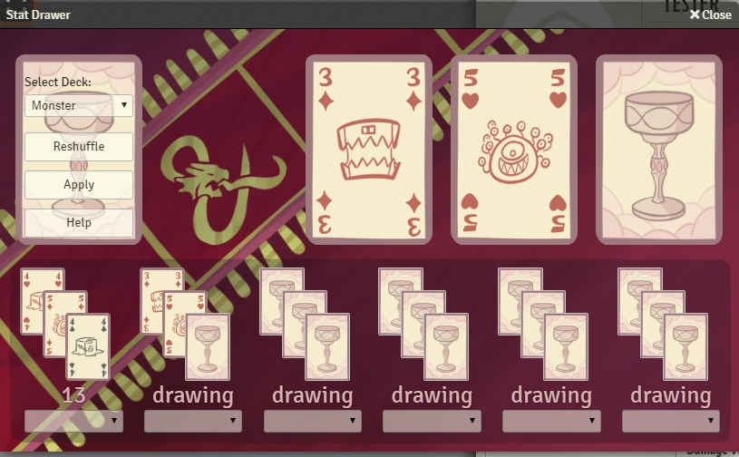

# Stat Drawer

A module for Foundry VTT that lets you generate ablitiyscores for characters using the "Holy Grail" method as described [here](https://www.reddit.com/r/DnD/comments/c67dft/oc_another_character_stat_generation_method_i/)!

## Installation
1. Copy this link and use it in Foundrys Module Manager to install the Module

    > https://raw.githubusercontent.com/syl3r86/statdrawer/master/module.json
    
2. Enable the Module in your Worlds Module Settings

## Decks
There are 2 visually distinct decks that can be chosen from. Each deck contains cards of the following values: 4x2, 3x3, 4x4, 3x5, 4x6.
The used artwork for cards and the values can be edited in the json files in the decks folder.
An ingame configuration menu is planed for a later date.

## Apply Abilities
You can select which ability a score should be assigned to. Once all 6 scores have been generated and the ability has been asigned you can apply those scores to the character by hitting the Apply button.

## Contribution
All credit for artwork (cards and the background image) goes to [@Setsuretsu](https://twitter.com/setsuretsu)

If you feel like supporting my work, feel free to leave a tip at my paypal felix.mueller.86@web.de

## License
The sourcecode (javascript, css and html) falls under this licence:

 Stat Drawer - a module for Foundry VTT - by <a xmlns:cc="http://creativecommons.org/ns#" href="https://github.com/syl3r86?tab=repositories" property="cc:attributionName" rel="cc:attributionURL">Felix Müller</a> is licensed under a <a rel="license" href="http://creativecommons.org/licenses/by/4.0/">Creative Commons Attribution 4.0 International License</a>.

The Artworks licence is as follows:

 Stat Drawer Artwork by <a xmlns:cc="http://creativecommons.org/ns#" href="https://twitter.com/setsuretsu" property="cc:attributionName" rel="cc:attributionURL">Setsuretsu</a> is licensed under a <a rel="license" href="http://creativecommons.org/licenses/by/4.0/">Creative Commons Attribution 4.0 International License</a>.

This work is licensed under Foundry Virtual Tabletop [EULA - Limited License Agreement for module development v 0.4.7](https://foundryvtt.com/article/license/).
